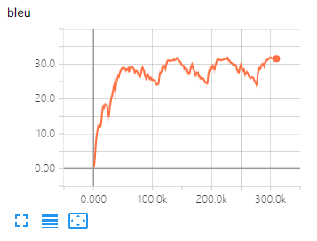
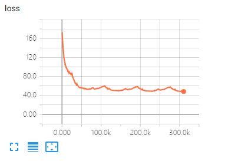

# DL4MT-theano

A **Neural Machine Translation** system based on [dl4mt-tutorial](https://github.com/nyu-dl/dl4mt-tutorial)

and [TheanoLayer](https://github.com/whr94621/TheanoLayer).

## Features

- Allow gradients accumulation (this is very useful if you want to seperate a larger batch into small batch)

- Monitor training using tensorboard

- batch beam search (very efficiency when using GPU)

- learning rate decay according to dev loss (See details in [Stronger Baselines for Trustable Results in Neural Machine Translation](https://aclweb.org/anthology/W/W17/W17-3203.pdf))

## Requirements

- [theano 1.0.1](http://www.deeplearning.net/software/theano/install.html)

- [TheanoLayer](https://github.com/whr94621/TheanoLayer)

- tensorboardX

## Benchmark

### WMT17 EN-DE

#### Speed (1080ti)

| **Training**                    | around 4500 words/sec |
|-----------------------------|-----------------------|
| **Inference**(batch=10, beam=5) | N/A                   |

#### Result

**Dev**: newtest 2016 **Test**: newstest 2017 (dev BLEU in the parenthesis)

|    | DE           | EN           |
|----|--------------|--------------|
| DE | N/A          | 28.26(32.11) |
| EN | 23.09(29.94) | N/A          |

#### BLEU/Loss curves

